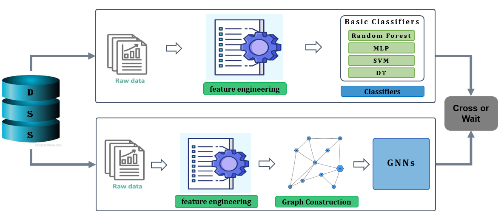
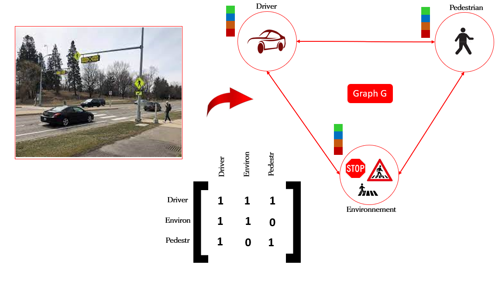
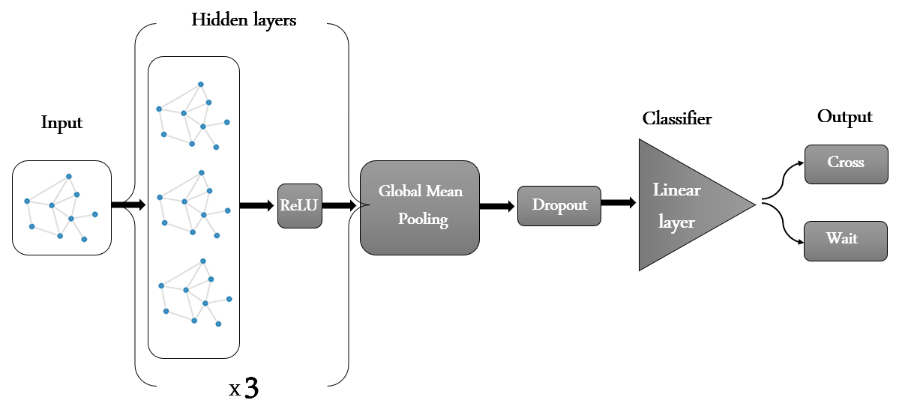

# Is the pedestrian going to cross or wait? Predicting Pedestrian
Crossing Intention with Graph Neural Network
### Taki Youssef

### Graph Model

<br />
we propose a Graphs Convolutional Network (GCN), which collects information about the social interactions of pedestrians , Driver, and Environement in a real driving scenario  by focusing on extracting the largest number of information and creating a graph,  Our results show an improvement over the state of art by 8% on the Accuracy.


#### Model
<div align='center'>
  
</div>

<br />
GCNN model consists of 2 building phases: <br />
1- Graph Construction:  <br 
 <div align='center'>
</img>
</div>
2- GNN : <br />
<div align='center'>
</img>
</div>


### Setup: 
The code was written using python 3.6. 
The following libraries are the minimal to run the code: 
```python
import pytorch
import networkx
import numpy
import tqdm
```
or you can have everything set up by running: 
```bash
pip install -r requirements.txt
```
### Using the code:
To use the pretrained models at `checkpoint/` and evaluate the models performance run:
```bash
test.py
```

To train a model for each data set with the best configuration as in the paper, simply run:
```bash
./train.sh  
```
